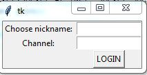
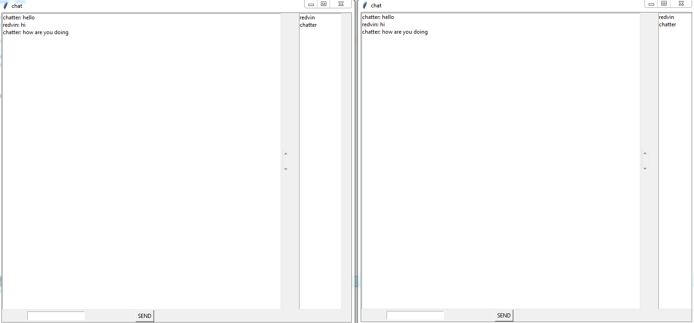

# ChatApp
Simple chat server and client made with Python. Program uses python's sockets for transmitting messages and tkinter for graphical display. Chat server supports multiple channels per user. 

# Instructions
For running the chatserver you need to have both server.py and channel.py downloaded in same folder. Also you need to have port 55555 open and free for use. You can join different channels by writing /join channelname. If channel doesnt exist it's created after joining.

# Screenshots

  
  

